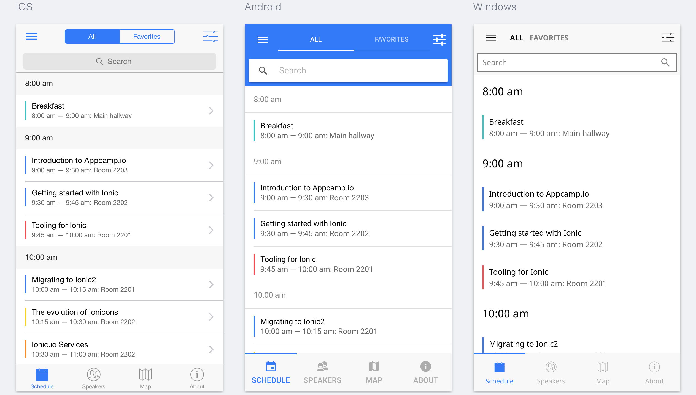
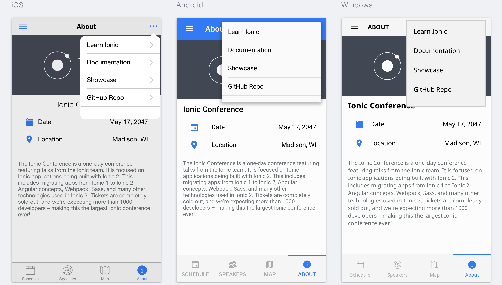

# Ionic 2 UI 示例

一个使用TypeScriptc的Ionic2UI示例程序。

## 导航
 - [开始](#开始)
 - [使用示例](#使用示例)
 - [App预览](#App预览)
 - [App架构](#App架构)


## 开始

* 使用 `git clone` 命令。
* 在程序根目录依次运行 1.`npm install` 2. `npm install -g ionic`（ionic是项目的依赖包）。
* 运行 `ionic serve` 看看发生了啥

**贴士:**  `ionic serve -d -b`可以关闭实时编译，运行更快，而且不会自动打开浏览器哦。

## 使用示例

* 表单 - [ [示例](https://github.com/zhangji1992/ionic-conference-app-master/src/pages/speaker-list/speaker-list.html) | [源码](https://github.com/zhangji1992/ionic-conference-app-master/src/pages/speaker-list/speaker-list.ts) ]
* 提示 - [ [源码](https://github.com/zhangji1992/ionic-conference-app-master/src/pages/schedule/schedule.ts) ]
* 卡片 - [ [示例](https://github.com/zhangji1992/ionic-conference-app-master/src/pages/speaker-list/speaker-list.html) ]
* 日期时间 - [ [示例](https://github.com/zhangji1992/ionic-conference-app-master/src/pages/about/about.html) ]
* 表格 - [ [示例](https://github.com/zhangji1992/ionic-conference-app-master/src/pages/login/login.html) ]
* 输入 - [ [示例](https://github.com/zhangji1992/ionic-conference-app-master/src/pages/login/login.html) ]
* 条目 (划动框) - [ [示例](https://github.com/zhangji1992/ionic-conference-app-master/src/pages/schedule/schedule.html) | [源码](https://github.com/zhangji1992/ionic-conference-app-master/src/pages/schedule/schedule.ts) ]
* 目录 - [ [示例](https://github.com/zhangji1992/ionic-conference-app-master/src/app/app.template.html) |
[源码](https://github.com/zhangji1992/ionic-conference-app-master/src/app/app.component.ts) ]
* 模态框 - [ [示例](https://github.com/zhangji1992/ionic-conference-app-master/src/pages/schedule-filter/schedule-filter.html) | [源码](https://github.com/zhangji1992/ionic-conference-app-master/src/pages/schedule/schedule.ts) ]
* 搜索框 - [ [示例](https://github.com/zhangji1992/ionic-conference-app-master/src/pages/schedule/schedule.html) | [源码](https://github.com/zhangji1992/ionic-conference-app-master/src/pages/schedule/schedule.ts) ]
* 切换视图 - [ [示例](https://github.com/zhangji1992/ionic-conference-app-master/src/pages/schedule/schedule.html) | [源码](https://github.com/zhangji1992/ionic-conference-app-master/src/pages/schedule/schedule.ts) ]
* 划动框 - [ [示例](https://github.com/zhangji1992/ionic-conference-app-master/src/pages/tutorial/tutorial.html) |
* 标题栏 - [ [示例](https://github.com/zhangji1992/ionic-conference-app-master/src/pages/schedule/schedule.html) ]
* 底部选项卡 - [ [示例](https://github.com/zhangji1992/ionic-conference-app-master/src/pages/tabs/tabs.html) | [源码](https://github.com/zhangji1992/ionic-conference-app-master/src/pages/tabs/tabs.ts) ]
* 切换控制 - [ [示例](https://github.com/zhangji1992/ionic-conference-app-master/src/pages/schedule-filter/schedule-filter.html) |
[源码](https://github.com/zhangji1992/ionic-conference-app-master/src/pages/tutorial/tutorial.ts) ]
* 利用Augular控制JSON - [ [源码](https://github.com/zhangji1992/ionic-conference-app-master/src/providers/conference-data.ts) | [用法](https://github.com/zhangji1992/ionic-conference-app-master/src/pages/schedule/schedule.ts) ]


## App预览

所有的App页面预览可以通过运行`ionic serve --lab`在浏览器上看到。

- [模块页面](https://github.com/zhangji1992/ionic-conference-app-master/src/pages/schedule/schedule.html)

  


- [关于页面](https://github.com/zhangji1992/ionic-conference-app-master/src/pages/about/about.html)

  


- 更多页面，请移步 [预览页面目录](https://github.com/zhangji1992/ionic-conference-app-master/resources/screenshots)!


## App架构

```
ionic-conference-app/
├-- .github/                            * GitHub 文件
│   ├── CONTRIBUTING.md                 * 贡献者们
│   └── ISSUE_TEMPLATE.md               * 提交问题并解决的样例
|
|-- resources/
|
|-- src/
|    |-- app/
|    |    ├── app.component.ts
|    |    └── app.module.ts
|    |    └── app.template.html
|    |    └── main.dev.ts
|    |    └── main.prod.ts
|    |
|    |-- assets/
|    |    ├── data/
|    |    |    └── data.json
|    |    |
|    |    ├── fonts/
|    |    |     ├── ionicons.eot
|    |    |     └── ionicons.svg
|    |    |     └── ionicons.ttf
|    |    |     └── ionicons.woff
|    |    |     └── ionicons.woff2
|    |    |
|    |    ├── img/
|    |
|    |-- pages/                          * 包含了所有页面
│    │    ├── about/                     * 关于模块
│    │    │    ├── about.html            * 页面
│    │    │    └── about.ts              * 代码
│    │    │    └── about.scss            * 样式
│    │    │
│    │    ├── account/                   * 账户模块
│    │    │    ├── account.html          * 页面
│    │    │    └── account.ts            * 代码
│    │    │    └── account.scss          * 样式
│    │    │
│    │    │── login/                     * 登录模块
│    │    │    ├── login.html            * 页面
│    │    │    └── login.ts              * 代码
│    │    │    └── login.scss            * 样式
│    │    │
│    │    │── map/                       * 地图模块
│    │    │    ├── map.html              * 页面
│    │    │    └── map.ts                * 代码
│    │    │    └── map.scss              * 样式
│    │    │
│    │    │── schedule/                  * 计划模块
│    │    │    ├── schedule.html         * 页面
│    │    │    └── schedule.ts           * 代码
│    │    │    └── schedule.scss         * 样式
│    │    │
│    │    │── schedule-filter/            * 计划过滤器模块
│    │    │    ├── schedule-filter.html   * 页面
│    │    │    └── schedule-filter.ts     * 代码
│    │    │    └── schedule-filter.scss   * 样式
│    │    │
│    │    │── session-detail/            * 会话详情模块
│    │    │    ├── session-detail.html   * 页面
│    │    │    └── session-detail.ts     * 代码
│    │    │
│    │    │── signup/                    * 登出模块
│    │    │    ├── signup.html           * 页面
│    │    │    └── signup.ts             * 代码
│    │    │
│    │    │── speaker-detail/            * 会话人详情模块
│    │    │    ├── speaker-detail.html   * 页面
│    │    │    └── speaker-detail.ts     * 代码
│    │    │    └── speaker-detail.scss   * 样式
│    │    │
│    │    │── speaker-list/              * 会话模块
│    │    │    ├── speaker-list.html     * 页面
│    │    │    └── speaker-list.ts       * 代码
│    │    │    └── speaker-list.scss     * 样式
│    │    │
│    │    │── tabs/                      * 底部导航条模块
│    │    │    ├── tabs.html             * 页面
│    │    │    └── tabs.ts               * 代码
│    │    │
│    │    └── tutorial/                  * 使用帮助模块
│    │         ├── tutorial.html         * 页面
│    │         └── tutorial.ts           * 代码
│    │         └── tutorial.scss         * 样式
|    |
│    ├── providers/                      * 包含了所有依赖注入
│    │     ├── conference-data.ts        * 会议数据
│    │     └── user-data.ts              * 用户数据
│    ├── theme/                          * App 主题
|    |     ├── variables.scss            * App 全局样式
|    |
|    |-- index.html
|
|-- www/
|    ├── assets/
|    |    ├── data/
|    |    |    └── data.json
|    |    |
|    |    ├── fonts/
|    |    |     ├── ionicons.eot
|    |    |     └── ionicons.svg
|    |    |     └── ionicons.ttf
|    |    |     └── ionicons.woff
|    |    |     └── ionicons.woff2
|    |    |
|    |    ├── img/
|    |
|    └── build/
|    └── index.html
|
├── .editorconfig                       * 编辑器配置文件
├── .gitignore                          * git 忽略配置文件
├── LICENSE                             * 使用证书
├── README.md                           * 本文件
├── config.xml                          * Cordova 配置文件
├── ionic.config.json                   * Ionic 配置文件
├── package.json                        * 定义 JavaScript 环境
├── tsconfig.json                       * 定义根文件和编译配置文件
├── tslint.json                         * 定义TypeScript linter 规则
```
